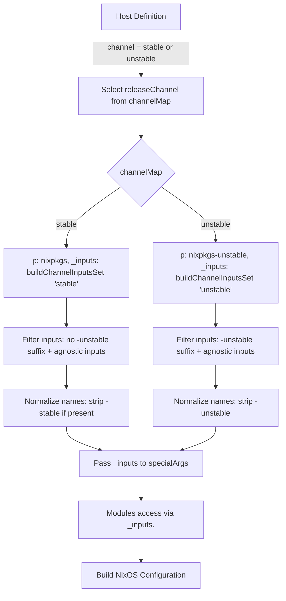

<p align="center" style="font-size: 1.5em;"><em>An extensible framework to build rock-solid, up-to-date NixOS hosts</em></p>

<p align="center" style="font-size: 1.5em;">
  <strong>Powered by <a href="https://github.com/cig0/modulon" style="color: inherit; text-decoration: none;">Modulon 🤖</a></strong> — a plug-and-play module management framework for NixOS flakes
</p>

<br>

A modular, flexible NixOS flake for multi-host, multi-channel setups — enabling varied system combinations while staying compatible with third‑party flakes:

- Stable release with stable packages (a reliable workhorse)
- Stable release with unstable packages (best of both worlds)
- Development snapshot with unstable packages (bleeding edge)
- Development snapshot with selected stable packages (for compatibility needs)

While fully usable (I use it daily), this flake is still under heavy development. **Bugs may show up for lunch.** Use at your own risk! 🔥

## Table of Contents

- [Table of Contents](#table-of-contents)
- [Overview](#overview)
- [Key Features](#key-features)
- [How It Works](#how-it-works)
  - [Flake Structure](#flake-structure)
  - [Directory Tree Structure](#directory-tree-structure)
  - [NixOS Configuration](#nixos-configuration)
  - [Home Manager Integration](#home-manager-integration)
- [Multi-Channel Support](#multi-channel-support)
  - [Dual Inputs for Channel Variants](#dual-inputs-for-channel-variants)
  - [Channel Mapping and Input Normalization](#channel-mapping-and-input-normalization)
  - [Passing Inputs to Modules](#passing-inputs-to-modules)
  - [Host Configuration](#host-configuration)
  - [Usage](#usage)
  - [Benefits](#benefits)
  - [Limitations and Considerations](#limitations-and-considerations)
- [Getting Started](#getting-started)
  - [Prerequisites](#prerequisites)
  - [Installation](#installation)
- [Customization Examples](#customization-examples)
  - [Adding a New Host](#adding-a-new-host)
  - [Switching a Host to Unstable Channel](#switching-a-host-to-unstable-channel)
  - [Extending Modules](#extending-modules)
- [Visual Workflow](#visual-workflow)
- [Contributing](#contributing)
- [License](#license)

## Overview

This NixOS flake configuration is built to manage multiple hosts (e.g., laptops, desktops, servers) with a modular approach, separating core system setup, host-specific settings, and user configurations via Home Manager. It introduces a robust multi-channel support system, allowing hosts to independently use either the stable or unstable Nixpkgs channel without requiring separate flakes or manual input adjustments. This setup is ideal for users who need to balance reliability (stable) with cutting-edge features (unstable) across different machines.

## Key Features

- **Multi-Host Management**: Configure distinct hosts (e.g., `desktop`, `tuxedo`, `chuwi`) with tailored settings from a single flake.
- **Multi-Channel Support**: Choose between stable (`nixos-24.11`) and unstable (`nixos-unstable`) channels per host, with automatic alignment of third-party flake inputs.
- **Modular Design**: Separate NixOS system configurations and Home Manager user settings into reusable, maintainable modules.
- **Dynamic Input Normalization**: Automatically filter and normalize third-party flake inputs based on the selected channel, ensuring compatibility and consistent referencing.
- **Extensibility**: Easily add new hosts, modules, or third-party dependencies with minimal configuration overhead.

## How It Works

### Flake Structure

The flake is organized into several key directories and files:

- **`flake.nix`**: The core entry point defining inputs (Nixpkgs, third-party flakes), outputs (NixOS configurations), and the logic for channel selection and input normalization.
- **`configs/nixos/`**: Contains host-specific configurations (`configuration.nix`, `profile.nix`) and shared modules for system settings (e.g., networking, security).
- **`configs/home-manager/`**: Manages user-specific settings and packages via Home Manager, with a dynamic module loader in `home.nix`.
- **`lib/`**: Custom libraries or utilities (e.g., ANSI color formatting) used across configurations.
- **`secrets/`**: Handles encrypted secrets for secure configuration (e.g., using `agenix`).
- 
### Directory Tree Structure

Below is an overview of the directory structure for this NixOS flake configuration, providing a clear view of how files and configurations are organized:

```
.
├── assets/                # Media assets for the repository documentation
├── configs/               # All system configurations
│   ├── home-manager/      # Home Manager configurations
│   │   ├── modules/       # Home Manager modules
│   │   └── users/         # User-specific configurations
│   └── nixos/             # NixOS configurations
│       ├── hosts/         # Host-specific configurations
│       ├── modules/       # NixOS modules
│       └── overlays/      # NixOS overlays
├── flake.lock
├── flake.nix
├── lib/                   # Shared libraries and helper tools
├── secrets                # Where the flake looks for the secrets
├── README.md
└── tests/                 # Tests for modules
    ├── home-manager       # Home Manager tests
    └── nixos/             # NixOS tests
```

This structure ensures a modular and organized approach, separating system-wide NixOS settings, user-specific Home Manager configurations, and supporting utilities or tests into distinct directories for clarity and maintainability.

### NixOS Configuration

- **Base Configuration**: Default system settings are defined in shared modules under `configs/nixos/modules/`, applied to all hosts.
- **Host-Specific Settings**: Each host has a dedicated directory (e.g., `configs/nixos/hosts/desktop/`) with `configuration.nix` for core setup and `profile.nix` for overrides or custom options.
- **Dynamic Modules**: The `modulon` framework enables dynamic loading of NixOS modules, enhancing extensibility.

### Home Manager Integration

- **Entry Point**: `configs/home-manager/home.nix` serves as the starting point for user configurations, integrating with NixOS via a module.
- **User Profiles**: User-specific settings (e.g., shell configurations, dotfiles) are modularized under `configs/home-manager/users/` and `modules/`, loaded dynamically.

## Multi-Channel Support

This flake implements a sophisticated mechanism to support both stable and unstable Nixpkgs channels within a single configuration, addressing the challenge of aligning third-party flake inputs with the appropriate channel.

### Dual Inputs for Channel Variants

- **Stable and Unstable Inputs**: For each third-party flake dependency, both stable and unstable variants are defined in the `inputs` attribute set. Stable inputs typically follow the `nixpkgs` channel (e.g., `nixos-24.11`), while unstable variants follow `nixpkgs-unstable` and often point to the latest or master branch of the respective repository.
  - Example: `home-manager` follows `nixpkgs` with a specific release tag, while `home-manager-unstable` follows `nixpkgs-unstable` and tracks the master branch.
- **Naming Convention**: Unstable variants are suffixed with `-unstable` (e.g., `nixvim-unstable`), while stable variants either have no suffix or use `-stable` if explicit distinction is needed. Channel-agnostic inputs (those without a specific channel dependency) may not have suffixes.

### Channel Mapping and Input Normalization

- **Channel Map Definition**: Within the `mkHostConfig` function, a `channelMap` attribute defines two channels: `stable` and `unstable`. Each channel specifies:
  - `p`: The Nixpkgs source (`nixpkgs` for stable, `nixpkgs-unstable` for unstable).
  - `_inputs`: A normalized set of third-party inputs tailored to the channel, constructed via `buildChannelInputsSet`.
- **Input Filtering and Normalization**:
  - The `buildChannelInputsSet` function filters inputs based on the channel:
    - For `unstable`, it selects inputs with the `-unstable` suffix.
    - For `stable`, it selects inputs without the `-unstable` suffix (including those with `-stable` or no suffix).
  - Channel-agnostic inputs (those without suffixes) are included in both channels.
  - Suffixes are stripped to create normalized names (e.g., `nixvim-unstable` becomes `nixvim` for the unstable channel, `nixvim` remains `nixvim` for stable), ensuring consistent referencing in modules regardless of channel.
- **Selection**: The `releaseChannel` is determined by the host’s `channel` attribute (`stable` or `unstable`), selecting the appropriate Nixpkgs source and input set.

### Passing Inputs to Modules

- **Special Arguments**: The normalized input set is passed to modules via `specialArgs` as `_inputs = releaseChannel._inputs;`. This allows modules to reference third-party flakes consistently as `_inputs.<normalizedName>` (e.g., `_inputs.home-manager` or `_inputs.nix-snapd`), regardless of whether the underlying input is from the stable or unstable variant.
- **Direct Access in Core Logic**: Within `mkHostConfig`, inputs are accessible as `releaseChannel._inputs.<normalizedName>` for module imports or configurations.

### Host Configuration

- **Channel Selection**: Each host in the `hosts` attribute set specifies a `channel` attribute (`stable` or `unstable`), determining which Nixpkgs source and input set are used via `channelMap`.
- **Unstable Overlays**: For hosts using the `unstable` channel, an overlay is added to provide access to stable packages via `stablePkgs`, allowing selective use of stable packages if needed.

### Usage

- **Defining Host Channel**: Set the `channel` attribute in a host’s configuration to either `"stable"` or `"unstable"` to select the desired Nixpkgs channel and corresponding third-party inputs.
  - Example: In `hosts.tuxedo`, setting `channel = "unstable";` uses `nixpkgs-unstable` and unstable variants of inputs like `home-manager-unstable`.
- **Referencing Inputs in Modules**: Use `_inputs.<normalizedName>` to access third-party flakes in custom modules, ensuring channel compatibility without hardcoding specific variants.
  - Example: `_inputs.nixvim.nixosModules.nixvim` works for both stable and unstable channels due to normalized naming.

### Benefits

- **Single Flake, Multiple Channels**: Manage hosts on different channels within one flake, avoiding the need for separate flakes for stable and unstable configurations.
- **Third-Party Compatibility**: Dynamically align third-party flakes with the host’s channel, preventing version mismatches without manual intervention.
- **Simplified Maintenance**: Normalized input names reduce code duplication and simplify module imports, as the same reference works across channels.

### Limitations and Considerations

- **Input Variants Required**: Each third-party flake must have stable and unstable variants defined in `inputs`, which may require manual updates if new dependencies are added.
- **Upstream Channel Support**: Some third-party flakes may not fully support both channels or may require additional configuration to align with `nixpkgs-unstable`. Ensure upstream compatibility when using the unstable channel.
- **Testing**: Thoroughly test host configurations after switching channels, as differences in package versions or flake behaviors may introduce issues.

## Getting Started

### Prerequisites

- **NixOS with Flake Support**: Ensure you have NixOS installed with flake support enabled (`nix.flakes` in your configuration or via `nix --experimental-features 'nix-command flakes'`).
- **Basic Nix Knowledge**: Familiarity with Nix expressions, modules, and flakes will help in navigating and customizing this configuration.

### Installation

1. **Clone the Repository**: If this flake is hosted on GitHub or another repository, clone it to your system:
   ```bash
   git clone https://github.com/cig0/nixos-config.git
   cd nixos-config
   ```
2. **Review Hosts**: Check the `hosts` attribute in `flake.nix` to see predefined hosts (`chuwi`, `desktop`, `tuxedo`) and their configurations.
3. **Build a Host Configuration**: Use `nixos-rebuild` to build and apply a configuration for a specific host:
   ```bash
   sudo nixos-rebuild switch --flake .#desktop
   ```
   Replace `desktop` with the desired host name from the `hosts` set.
4. **Customize**: Follow the customization examples below to add new hosts or modify settings.

## Customization Examples

### Adding a New Host

To add a new host named `laptop` using the stable channel:

1. **Create Host Directory**: Add a directory for the new host under `configs/nixos/hosts/laptop/`.
2. **Define Configuration Files**:
   - Create `configs/nixos/hosts/laptop/configuration.nix` with core system settings (e.g., bootloader, networking).
   - Create `configs/nixos/hosts/laptop/profile.nix` with host-specific options or overrides.
3. **Update Hosts in `flake.nix`**: Add the host to the `hosts` attribute set:
   ```nix
   laptop = {
     description = "New Laptop: AMD CPU & GPU + GNOME";
     channel = "stable";
     system = "x86_64-linux";
     extraModules = [ ];
   };
   ```
4. **Build and Apply**: Build the configuration for the new host:
   ```bash
   sudo nixos-rebuild switch --flake .#laptop
   ```

### Switching a Host to Unstable Channel

To switch an existing host (e.g., `tuxedo`) to the unstable channel:

1. **Update Channel Attribute**: In `flake.nix`, modify the `channel` for the host:
   ```nix
   tuxedo = {
     description = "Laptop: Intel CPU & GPU + KDE";
     channel = "unstable"; # Changed from "stable"
     system = "x86_64-linux";
     extraModules = [ inputs.nixos-hardware.nixosModules.tuxedo-infinitybook-pro14-gen7 ];
   };
   ```
2. **Rebuild Configuration**: Rebuild the host to apply the unstable channel and associated inputs:
   ```bash
   sudo nixos-rebuild switch --flake .#tuxedo
   ```
   The system will now use `nixpkgs-unstable` and unstable variants of third-party flakes.

### Extending Modules

To add a new module for a custom application or setting:

1. **Create Module File**: Add a new module under `configs/nixos/modules/applications/` or another relevant directory (e.g., `my-app.nix`).
2. **Define Configuration**: Specify the desired settings in the module, referencing `_inputs` if using third-party flakes:
   ```nix
   { _inputs, ... }:
   {
     imports = [ _inputs.my-app.nixosModules.my-app ];
     # Additional configurations
   }
   ```
3. **Ensure Dynamic Loading**: The `modulon` framework automatically loads modules from specified directories, so no further changes are needed if placed in `configs/nixos/modules/`.

## Visual Workflow

Below is a simplified flowchart illustrating how channel selection and input normalization work in this flake, making the process easier to grasp visually:



This diagram shows the flow from host channel selection to input filtering, normalization, and usage in modules, ensuring channel-specific compatibility.

## Contributing

Contributions to improve this flake configuration are welcome! Whether it's bug fixes, new features, or documentation enhancements, feel free to submit pull requests or open issues on the GitHub repository (once published). Please ensure changes are tested across both stable and unstable channels if relevant.

## License

Unless otherwise stated, everything in this repo is covered by the following copyright notice:

```plaintext
A NixOS multi-host, multi-channel setups flake.
Copyright (C) 2024-2025  Martín Cigorraga <cig0.github@gmail.com>

This program is free software: you can redistribute it and/or modify it
under the terms of the GNU Affero General Public License v3 or later, as
published by the Free Software Foundation.

This program is distributed in the hope that it will be useful,
but WITHOUT ANY WARRANTY; without even the implied warranty of
MERCHANTABILITY or FITNESS FOR A PARTICULAR PURPOSE.  See the
GNU General Public License for more details.

You should have received a copy of the GNU General Public License
along with this program.  If not, see <http://www.gnu.org/licenses/>.
```
